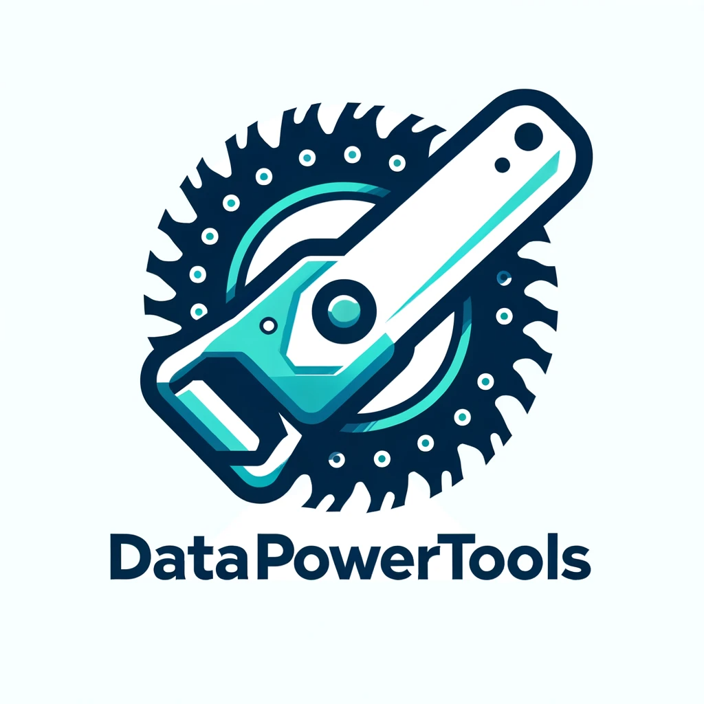

# DataPowerTools

## Take a chainsaw to your data!

ADO.NET Power Tools for In-Memory Data Processing with minimal dependencies.

### Overview

DataPowerTools are tools for dealing with changing between IEnumerable, IDataReader, and ADO.NET DataTable/DataSet. 

It also provides a powerful API for filtering and object materialization.

### Why DataPowerTools?

DataPowerTools is not dependent on any other frameworks or libraries such as Entity Framework or any other ORM. It has virtually no dependencies except for some core .NET / ADO.NET libraries. Nor does it try to be an ORM. It is simply a set of tools built around the ADO.NET IDataReader interface that allow you to manipulate the reader, apply transformations, and send this data somewhere else. For example, if you want to read a CSV, transform some column names, trim or truncate some columns, and map it to a SQL server destination and bulk insert, this allows you do do so in a very high performant way and with a low memory footprint. Check out the unit tests for examples.

### Getting Started

1. Install DataPowerTools nuget.
2. Use methods and extensions.

### Features

- Date string parsing
- SqlBulkCopy wrapper / map to SQL destination
- Fit table/CSV to SQL table
- SQLite Bulk operations
- Minimal dependencies
- Easily convert between IEnumerable <-> IDataReader <-> DataTable
- Json to SQL Insert Statements
- Unpivot DataTable or IDataReader